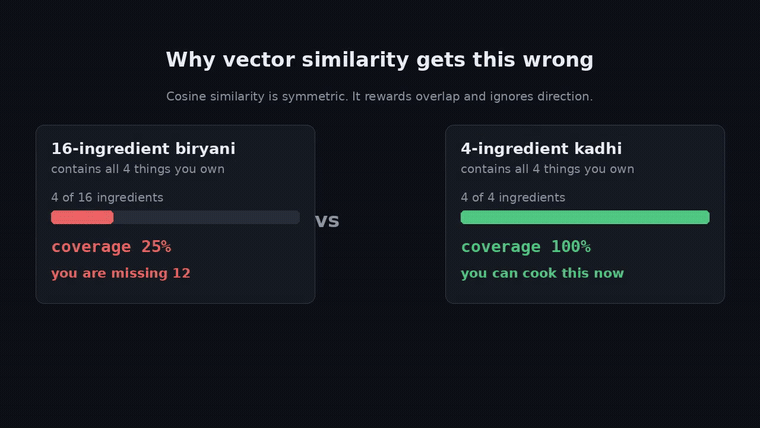

# 🍲 Indian Recipe Bot

**An AI-powered RAG chatbot.** Tell it what's in your kitchen and it tells you what you can actually cook tonight — grounded in a real recipe corpus, so it can't invent dishes that don't exist.

910 curated Indian recipes, lacto-vegetarian and eggless, weighted toward Gujarati and Punjabi. Built with **Python + LangChain + Google Gemini**.

---

## Watch the walkthrough

**[▶ docs/recipe-bot-narrated.mp4](docs/recipe-bot-narrated.mp4)** — 2m 37s, narrated. The idea, the ranking function, the RAG pipeline, the four data bugs, and the app answering live.



---

## How to run it

### 1. Check your Python

```bash
python3 --version
```

| Your version | Requirements file to use |
|---|---|
| 3.10 or newer | `requirements.txt` |
| 3.9 (e.g. macOS `/usr/bin/python3`) | `requirements-py39.txt` |
| 3.8 or older | Won't work — use `/usr/bin/python3` if that's 3.9+, or install 3.12 from [python.org](https://www.python.org/downloads/) |

### 2. Create a virtual environment and install

```bash
cd "POD Exercise"

python3 -m venv .venv                 # or: /usr/bin/python3 -m venv .venv
source .venv/bin/activate             # Windows: .venv\Scripts\activate
pip install --upgrade pip
pip install -r requirements.txt       # on Python 3.9: requirements-py39.txt
```

Build the venv from the interpreter you actually want — bare `python3` resolves to whatever is first on your PATH, which may not be the newest Python installed.

### 3. Add your Gemini API key

Get one free at **[aistudio.google.com/apikey](https://aistudio.google.com/apikey)** → *Create API key*.

```bash
printf 'GOOGLE_API_KEY=' > .env && read -rs K && echo "$K" >> .env && unset K
```

This prompts on a blank line and echoes nothing, so the key never appears on screen or in your shell history. `.env` is gitignored. If you skip this step the app asks for the key in the browser instead, and keeps it in memory only.

### 4. Run

```bash
streamlit run app.py
```

Opens at `http://localhost:8501`. The first launch embeds a budgeted slice of the corpus — 400 recipes by default, about a minute with a progress bar — and caches the vectors to `data/processed/`, so every later start is instant. Un-embedded recipes still rank; they just score 0 on the semantic term. The sidebar has an **Embed 400 more** button to extend the index whenever you want.

**Other ways to run the same engine:**

```bash
python -m src.chat_cli     # the bot in your terminal, no browser
make run                   # same as streamlit run app.py
make test                  # the test suite
make data                  # rebuild the corpus from the raw dataset
```

### 5. Try it

| Type this | What it shows |
|---|---|
| `I have besan, curd, ginger and green chilli` | Coverage-ranked dishes you can actually finish |
| `also add rice and jaggery` | Pantry persists across turns |
| `something light for dinner` | No ingredients in the question — semantic retrieval handles it |
| `do you have chicken biryani?` | It declines. The corpus is vegetarian and it won't pretend |
| `I have broccoli, olives and feta` | Nothing matches — it says so and labels the alternatives |

---

## What it does

| | |
|---|---|
| **Chat** | Multi-turn. The pantry persists, and "also add jaggery" extends it |
| **Pantry sidebar** | Shows what it thinks you have; add or clear by hand |
| **Retrieval panel** | Every reply expands to show which recipes were retrieved, their coverage %, ranking score and source link |
| **Honest fallback** | When nothing clears the coverage floor, it says so and labels the alternatives |
| **Grounded** | Every number in a reply is computed in Python, not predicted by the model |

The pantry lives in a Python `set`, not in conversation history — exact, free to maintain, and impossible for the model to lose track of.

## The RAG approach

Gemini never answers from training data. It answers from recipes we retrieve and place in the prompt, which makes the corpus the authority on facts and the model the authority only on phrasing.

```
                 ┌──────────────── INDEXING (once) ─────────────────┐
  6,871 rows ──▶ filter & clean ──▶ 910 docs ──▶ Gemini embeddings ──▶ cached vectors
                 └──────────────────────────────────────────────────┘

                 ┌──────────────── QUERY (per message) ─────────────┐
  "I have besan     parse pantry ──▶ semantic retrieval
   and curd"              │                     │
                          └──▶ coverage re-rank ┘
                                     │
                          candidates + computed coverage
                                     │
                          Gemini, instructed to use ONLY these
                                     │
                                  grounded answer
```

| Stage | Component | What it does |
|---|---|---|
| **Retrieve** | `gemini-embedding-001` (discovered at runtime) + cached numpy vectors | Embeds the question, finds the nearest recipes by cosine similarity |
| **Augment** | Prompt assembly in `src/rag.py` | Injects those recipes plus their computed coverage figures into the system prompt |
| **Generate** | `ChatGoogleGenerativeAI`, `temperature=0.2` | Phrases a reply constrained to the supplied candidates |

**Chunking:** one document per recipe. The data provides a natural boundary, so no chunk ever straddles two dishes.

**Vector store:** brute-force cosine over 910 × 3,072 floats — a few milliseconds. FAISS or Chroma would earn their place past ~100k documents. Vectors are cached against a fingerprint of the corpus, so they're rebuilt only when the corpus changes.

**Keeping it grounded:** the system prompt forbids inventing recipes or ingredients; temperature stays low because the bot reports facts; and all coverage percentages and missing-ingredient lists are computed in Python and handed to the model as text. Gemini is never asked to count.

Ask it *"how do I make chicken biryani?"* and it declines. **A RAG system that answers everything confidently hasn't been tested** — showing it refuse is what proves the grounding is real.

## The idea worth stealing

Ask a recipe search what you can make with *besan, curd, ginger, green chilli* and it ranks by text similarity. That's the wrong question.

Cosine similarity is **symmetric**. A sixteen-ingredient undhiyu containing all four of your items scores beautifully — and you can't cook it, because you're missing twelve things. A four-ingredient kadhi you *can* cook scores lower.

The real question isn't *"which recipe is most similar to my ingredients?"* but *"which recipe is most **covered** by my ingredients?"*

```
coverage = |pantry ∩ recipe| / |recipe|
```

Dividing by the **recipe's** size, not the pantry's, is the whole trick — it's asymmetric, and it punishes long recipes you can't finish. Final ranking:

```
score = 0.50·coverage + 0.20·similarity − 0.05·(missing/k) + 0.15·region_prior + 0.10·utilisation
```

Coverage asks *can I cook it*. Utilisation — `|pantry ∩ recipe| / |pantry|`, the same fraction flipped — asks *is it worth cooking*, so a dish that uses more of what you already have edges ahead of one that uses two items.

Staples are excluded from the denominator. Salt appears in 84% of the corpus, turmeric in 58%, oil in 52%; counting them as ingredients you must "have" pushed every recipe below the floor for a small pantry. [`config/pantry_staples.yaml`](config/pantry_staples.yaml) lists the 39 assumed items.

Semantic retrieval provides **recall** (survives "aubergine" vs "brinjal", handles *"something light for dinner"*). Coverage re-ranking provides **precision**. Neither stage can do the other's job — that's why there are two.

The regional prior is 1.0 for Gujarati, 0.4 for Punjabi, and capped so it can never overturn a coverage gap. Cookability wins; the prior breaks near-ties.

## The corpus

[6000+ Indian Food Recipes](https://www.kaggle.com/datasets/kanishk307/6000-indian-food-recipes-dataset), from [Archana's Kitchen](https://www.archanaskitchen.com/) ([CSV mirror](https://github.com/nileshely/Indian-Food)). Rebuild with `make data`.

| Stage | Recipes |
|---|---|
| Raw dataset | 6,871 |
| Vegetarian diet labels | 5,875 |
| After ingredient blocklist | 5,620 |
| Untranslated rows dropped | −719 |
| Quality gate — 3–12 shoppable ingredients, real instructions | |
| **Curated corpus — all-India, Gujarati and Punjabi weighted** | **910** |

## Four things the data got wrong

Every one would have passed code review. None threw an error.

**1. The diet label is misspelled.** 427 rows read `Non Vegeterian`. A filter written as `Diet != "Non Vegetarian"` lets every one through.

**2. The diet label is wrong anyway.** 55 recipes labelled `Vegetarian` contain meat or fish — *Singapore Style Chicken Layered Fried Rice*, *Andaman Style Steamed Garlic Prawns*, *Baked Fish In Coconut Milk*. 423 more contain egg despite a separate `Eggetarian` label existing. So the label is a weak first pass and [`config/excluded_ingredients.yaml`](config/excluded_ingredients.yaml) is the real gate.

**3. A byte-order mark hides every Gujarati recipe.**

```python
df[df.Cuisine == "Gujarati Recipes"]     # 0 rows
df[df.Cuisine.str.contains("Gujarati")]  # 132 rows
```

Written the obvious way, the Gujarati weighting would have done nothing, silently.

**4. 719 rows were never translated.** Devanagari text sits in the `Translated...` columns. Some have English ingredients but Hindi *instructions*, so they parse cleanly and then hand the user cooking steps they may not read. This surfaced as *12% of recipes parsing to zero ingredients* — it looked like a parser bug, and chasing the symptom found a data problem.

### The pattern

`"egg" in text` drops 143 recipes and **119 contain no egg** — they're aubergine dishes, because the dataset lists brinjal's synonyms and one of them is "Eggplant". Word-boundary matching on parsed entities drops 29 instead, and correctly keeps the recipes whose names contain *egg**less***.

Same lesson as the meat blocklist from the other direction: **match parsed entities, never raw strings.** The error budget is asymmetric on purpose — wrongly dropping a valid recipe costs one row out of 910; wrongly keeping a meat or egg recipe breaks the premise.

## Project structure

```
app.py                  Streamlit chat UI — the only file importing Streamlit
src/rag.py              retrieval, coverage ranking, grounded generation
src/corpus.py           ingredient parsing, coverage scoring, vocabulary
src/build_corpus.py     6,871 raw rows → 910 curated
src/chat_cli.py         the same engine in the terminal
src/paths.py            every filesystem path, in one place
config/                 ingredient blocklist, pantry staples, dish list
data/recipes_core.csv   the 910, committed so the app runs immediately
notebooks/              a step-by-step walkthrough of how it was built
tests/                  corpus invariants and scaffolding checks
```

`src/` never imports a UI framework. The engine is a library; the app, the CLI and the notebook are all thin callers.

## Troubleshooting

**`No matching distribution found for langchain>=0.3`**, after a wall of "Ignored the following versions that require a different python version" — your `pip` is attached to a Python older than 3.9, so it skips every modern langchain. Check with `python3 --version` and `which -a python3 pip pip3`, then build the venv from a 3.9+ interpreter.

**`ModuleNotFoundError` in the app** after a clean install — the venv isn't activated. `source .venv/bin/activate` first.

**`ModuleNotFoundError` in the notebook** — wrong kernel. Register one with `python -m ipykernel install --user --name recipe-bot --display-name "Recipe Bot"`, then Kernel → Change Kernel → Recipe Bot.

**The app asks for an API key every launch** — `.env` isn't being found. It must sit in the same directory you run `streamlit` from.

**Re-embedding on every start** — the vector cache lives in `data/processed/`. If that directory isn't writable the app silently re-embeds each time.

## Licence and attribution

Recipe data is from Archana's Kitchen, used here for a non-commercial educational exercise. Every recipe the bot surfaces links back to its original page.
